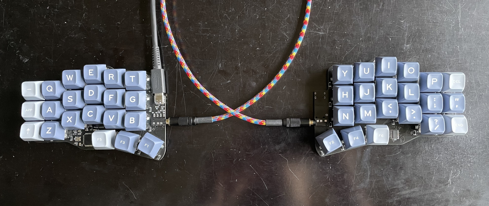
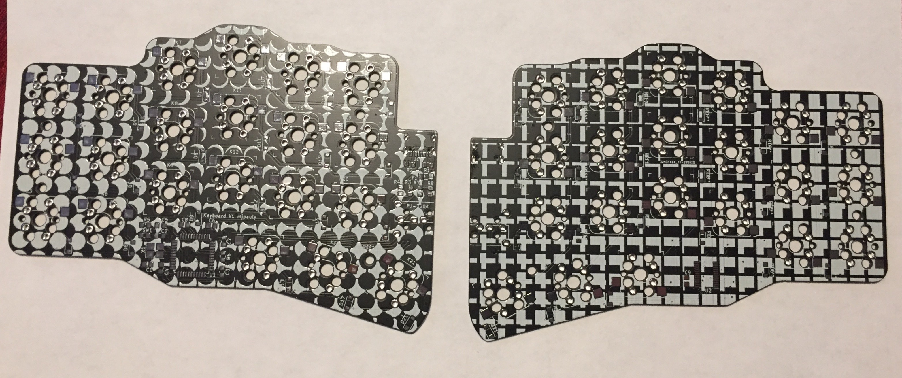
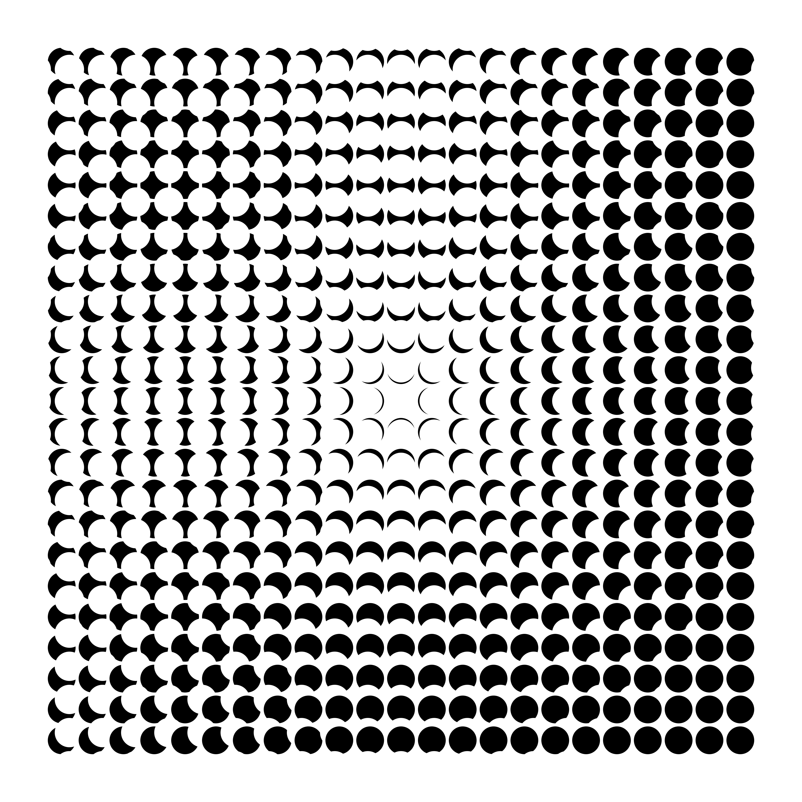
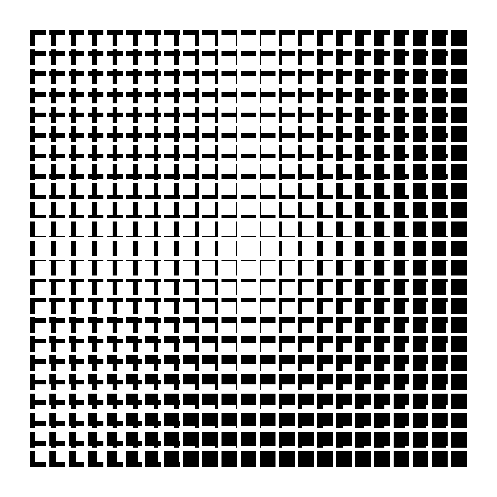

# Phase Keyboard

- Kyria stagger, Corne thumb cluster, Ferris-inspired electronics.
- USB-C
- Reversible PCB for use with both hands.
- MX-style key switch support with optional Kailh hot swap sockets.
- 42 keys.

A one-off moon-themed sand-cast aluminum case was also designed in Spring 2022. See [here](https://imgur.com/a/QfmxirT) for photos of the manufacturing process!

## Versions

### Version 1.0.1

- Assembled and tested
- Fixes SDA/SCL swap
- Removes silkscreen art (just too cluttered)
- Gerbers are at `phase/JLCPCB_2022-01-29_v1_0_1.zip`.

### Version 1.0.0

- Manufactured with JLCPCB, built, and tested.
- SDA and SCL are swapped, so some rework is required. The traces need to be cut, soldermask has to be scraped away, and wires have to be soldered where the soldermask was removed. See the image at `img/phase_v1_0_0_rework.jpeg`. This is fixed in v1.0.1.
- Gerbers at `phase/JCLPCB_2020-09-21_v1_0_0.zip`.

## Firmware

Firmware can be found here: [https://github.com/mjpauly/qmk_firmware/tree/master/keyboards/phase](https://github.com/mjpauly/qmk_firmware/tree/master/keyboards/phase). It's not merged into mainline QMK, but if you want to use the design then I can make that happen.

## BOM

The BOM for SMD components can be found at `phase/bom-with-pns-lcsc.csv`. This lists the part numbers that can be purchased from [LCSC](https://lcsc.com). In addition to this, the following may also needed for a complete keyboard:
- TRRS connectors from [AliExpress](https://www.aliexpress.com/item/33029465106.html).
- A TRRS cable. [This one](https://www.amazon.com/gp/product/B019EHMN68?psc=1) is good.
- [Kailh hot swap sockets](https://kbdfans.com/products/mechanical-keyboard-switches-kailh-pcb-socket).
- MX style switches.
- Keycaps: 42x 1u, option for 2x 1.5u keycaps for the center-most thumb keys.
- USB-C cable.
- Rubber feet. [3M SJ5376](https://www.digikey.com/en/products/detail/3m/SJ5376/3866077) are tall enough to work with the hot swap sockets and narrow enough to fit in the pattern of keys.

## Part libraries

All non-standard parts are in the project library except for the keyswitch footprint `Kailh_socket_MX_optional_reversible` from [daprice](https://github.com/daprice/keyswitches.pretty). Credit also goes to [Keebio](https://github.com/keebio/Keebio-Parts.pretty) for the TRRS connector footprint `TRRS-PJ-320A-dual`.

## Silkscreen on v1.0.0

The silkscreen is based on the following images generated with Processing. I felt like this made the PCB too cluttered, so it's removed in the latest version.

