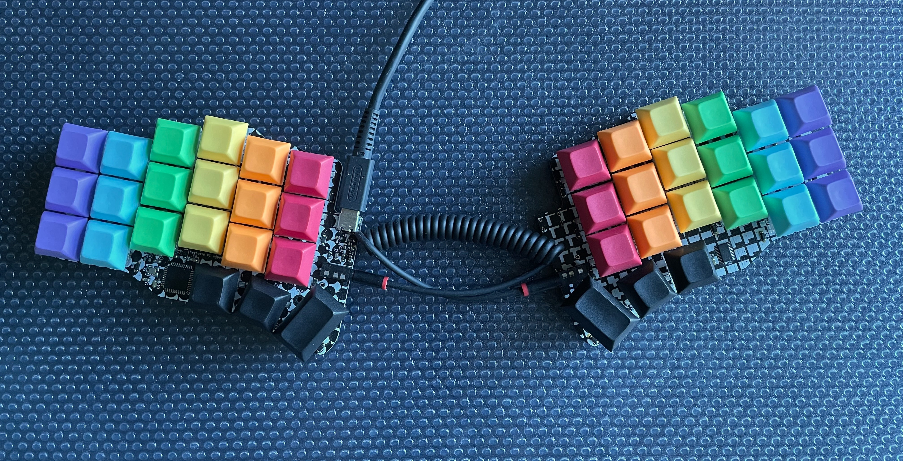
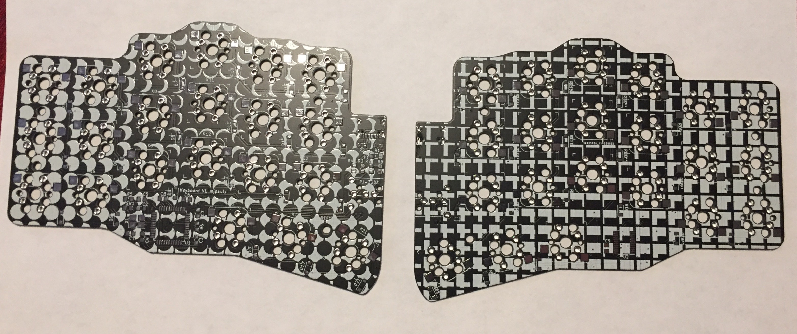

# Phase Keyboard

- Kyria stagger, Corne thumb cluster, Ferris-inspired electronics.
- USB-C
- Reversible PCB for use with both hands.
- MX-style key switch support with optional Kailh hot swap sockets.
- 42 keys.

## Version 1.0

- Manufactured with JLCPCB, built, and tested.
- SDA and SCL are swapped, so some rework is required. The traces need to be cut, soldermask has to be scraped away, and wires have to be soldered where the soldermask was removed. See the image at `img/phase_v1_0_rework.jpeg`. This will be fixed in a later version at some point.
- Gerbers sent to the fab can be found at `phase_v1_0/JCLPCB_2020-09-21.zip`.

## Part libraries

All non-standard parts are in the project library except for the keyswitch footprint `Kailh_socket_MX_optional_reversible` from [daprice](https://github.com/daprice/keyswitches.pretty). Credit also goes to [Keebio](https://github.com/keebio/Keebio-Parts.pretty) for the TRRS connector footprint `TRRS-PJ-320A-dual`.

## Firmware

Firmware can be found here: [https://github.com/mjpauly/qmk_firmware/tree/master/keyboards/phase](https://github.com/mjpauly/qmk_firmware/tree/master/keyboards/phase)

## BOM

The BOM for SMD components can be found at `phase_v1_0/bom-with-pns-lcsc.csv`. This lists the part numbers that can be purchased from [LCSC](https://lcsc.com). In addition to this, the following may also needed for a complete keyboard:
- TRRS connectors from [AliExpress](https://www.aliexpress.com/item/33029465106.html).
- A TRRS cable. [This one](https://www.amazon.com/gp/product/B019EHMN68?psc=1) is good.
- [Kailh hot swap sockets](https://kbdfans.com/products/mechanical-keyboard-switches-kailh-pcb-socket).
- MX style switches.
- Keycaps (40x 1u, 2x 1.5u).
    - For the keys pictured, I got [this set](https://kbdfans.com/products/dsa-ergo-blank-keycaps) with [these](https://kbdfans.com/products/dsa-blank-keycaps-1u-10pcs?variant=34194567004299) [two](https://kbdfans.com/products/dsa-blank-keycaps-1u-10pcs?variant=34194567364747) extra colors.
- USB-C cable.
- Rubber feet. [3M SJ5376](https://www.digikey.com/en/products/detail/3m/SJ5376/3866077) are tall enough to work with the hot swap sockets and narrow enough to fit in the pattern of keys.

## Silkscreen

The silkscreen is based on the following images generated with Processing.

